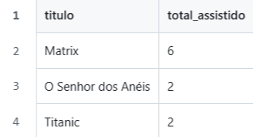

# 🎬 CineList – Projeto Filmes SQL

Banco de dados de obras cinematográficas criado para estudo de SQL.  
Inclui tabelas de **usuários, filmes e assistidos**, dados de exemplo e consultas para análise de informações.

## 📂 Estrutura do projeto

- `CineList.sql` → arquivo `.sql` com criação de tabelas, inserts e queries  
- `resultados/` → CSVs exportados das consultas (renderizados como tabelas no GitHub)  
- `imagens/` → prints dos resultados (opcional)  
- `README.md` → este arquivo explicativo

## 🗄️ Tabelas do banco

O projeto contém três tabelas principais:  

1. **usuarios** → nome, email  
2. **filmes** → título, gênero, ano  
3. **assistidos** → registros de filmes assistidos por usuário, com data e nota  

## 🔍 Consultas de exemplo

1. Top 3 filmes mais assistidos  
2. Média de nota por filme  
3. Filmes assistidos por usuário  
4. Filme mais assistido

## 📊 Resultados

Os resultados das consultas estão na pasta `resultados/` em **formato CSV**.  
O GitHub renderiza os CSVs como **tabelas bonitas**, facilitando a visualização.

## 📝 Consultas e exemplos de resultado

**1️⃣ Top 3 filmes mais assistidos**

**Query:**
`SELECT filmes.titulo
COUNT(assistidos.id_assistido) AS total_assistido 
FROM filmes 
JOIN assistidos ON filmes.id_filme = assistidos.id_filme 
GROUP BY filmes.id_filme ORDER BY total_assistido 
DESC LIMIT 3;`

## 📝 Aprendizados

- **Criação e relacionamento de tabelas (`JOIN`)**  
  Aprendi a conectar tabelas diferentes usando chaves primárias e estrangeiras para organizar os dados de forma relacional.

- **Agregações e ordenação (`COUNT`, `AVG`, `ORDER BY`)**  
  Pratiquei como calcular contagens, médias e ordenar resultados para gerar relatórios significativos.

- **Filtragem de dados (`WHERE`)**  
  Usei filtros para extrair informações específicas, como filmes assistidos por um usuário.

- **Exportação de resultados para CSV**  
  Aprendi a gerar arquivos CSV a partir das consultas e como o GitHub renderiza os resultados.

